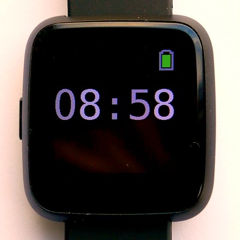

Watch Application System in Python
==================================

Currently in its infancy wasp-os provides nothing more than a simple
digital clock application for PineTime together with access to the
MicroPython REPL for interactive testing and tweaking. However it
keeps time well and has enough power saving functions implemented
that it can survive for well over 24 hours between charges so even
at this early stage it is functional as a wearable timepiece.

WASP includes a robust bootloader based on the Adafruit NRF52
Bootloader. It has been extended to make it robust for development on
form-factor devices without a reset button, power switch, SWD debugger
or UART. This allows us to confidently develop on sealed devices relying
only on BLE for updates.

Video
-----

Building from a git clone
-------------------------

~~~
pip3 install --user click serial pyserial
make submodules
make softdevice
make -j `nproc` BOARD=pinetime all
~~~

Note: *You will need a toolchain for the Arm Cortex-M4. wasp-os is developed and tested using the [GNU-RM toolchain](https://developer.arm.com/tools-and-software/open-source-software/developer-tools/gnu-toolchain/gnu-rm) (9-2019-q4) from Arm.*

Note #2: *There are known problems with toolchains older than gcc-7.3 due to problems with link-time-optimization (which is enabled by default)*

Installing
----------

Note: *If you have a new PineTime then it will have been delivered with
flash protection enabled. You must disable the flash protection before
trying to program it.*

* Use an SWD programmer to install `bootloader.hex` to the PineTime.
  This file is an Intel HEX file containing both the bootloader and
  the Nordic SoftDevice. Be careful to disconnect cleanly from the
  debug software since just pulling out the SWD cable will mean the
  nRF52 will still believe it is being debugged.
* Copy `micropython.zip` to your Android device and download nRF Connect
  for Android if you do not already have it.
* In nRF Connect, choose settings and reduce the DFU packet count from
  10 to 4.
* Connect to PineDFU using nRFConnect, click the DFU button and send
  `micropython.zip` to the device.

At the end of this process your watch will show the time (12:00) and a
battery meter. When the watch goes into power saving mode you can use
the side button to wake it again.

At this point you will also be able to use the Nordic UART Service to
access the MicroPython REPL, although currently you must send ^C to
interrupt the program that updates the watch display.

Just for fun try:

~~~
^C
import demo
demo.run()
# After watching the demo for a bit...
^C
wasp.app.draw(watch)
wasp.run()
~~~

To set the time and restart the main application:

~~~
^C
watch.rtc.set_time((hh, mm, ss))
wasp.run()
~~~

As mentioned above there are many drivers and features still to be
developed, see the [TODO list](todo.md) for current status.
